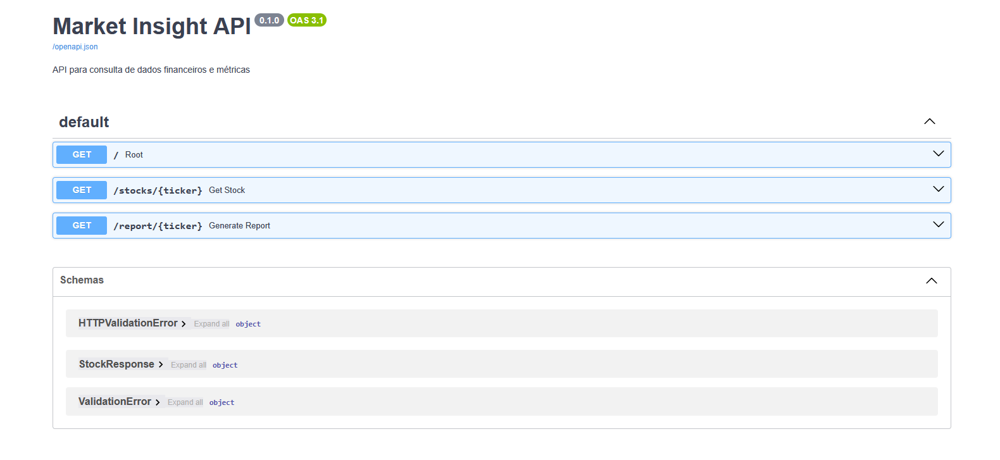
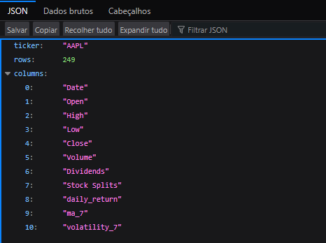
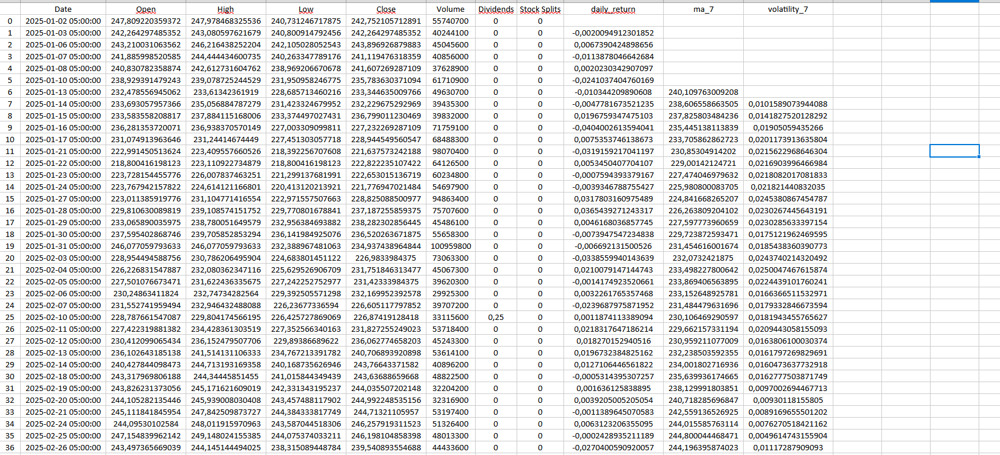
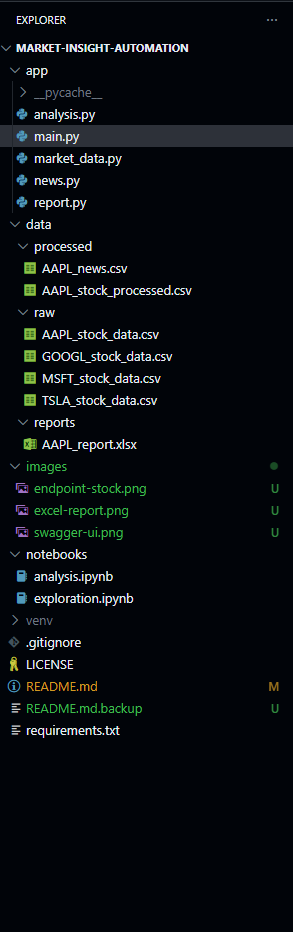

# 📈 Market Insight Automation API

> Sistema de automação para coleta, processamento e exposição de dados do mercado financeiro via API REST.

---

## 💼 Problema de Negócio

Analistas financeiros e investidores gastam tempo:

* Buscando dados históricos manualmente
* Calculando métricas no Excel
* Organizando informações
* Cruzando notícias com dados de mercado

Este projeto automatiza esse fluxo.

---

## 🎯 Solução

O Market Insight Automation:

* Coleta dados históricos automaticamente
* Processa e calcula métricas financeiras
* Gera relatórios estruturados
* Disponibiliza os dados via API REST
* Permite download automático de relatório em Excel

---

## 🧠 Arquitetura do Projeto

```
Coleta de Dados (yFinance)
        ↓
Processamento (Pandas)
        ↓
Cálculo de Métricas
        ↓
Geração de Relatório
        ↓
Exposição via FastAPI
```

---

## 📊 Métricas Calculadas

* Retorno diário
* Média móvel
* Volatilidade
* Estrutura tabular para análise posterior

---

## 🌐 API REST

### 🔹 1️⃣ Status

```
GET /
```

Resposta:

```json
{
  "status": "ok",
  "message": "API Market Insight está rodando"
}
```

---

### 🔹 2️⃣ Consulta de Ativo

```
GET /stocks/AAPL
```

Resposta:

```json
{
  "ticker": "AAPL",
  "rows": 252,
  "columns": [
    "Date",
    "Open",
    "High",
    "Low",
    "Close",
    "Volume",
    "Return",
    "Volatility"
  ]
}
```

---

### 🔹 3️⃣ Download de Relatório

```
GET /report/AAPL
```

Retorna automaticamente um arquivo Excel:

```
AAPL_report.xlsx
```

---

## 🛠️ Stack Tecnológica

* Python
* Pandas
* yFinance
* FastAPI
* Pydantic
* XlsxWriter
* Uvicorn

---

## 🗂️ Estrutura do Projeto

```
market_insight_automation/
│
├── app/
│   ├── main.py       # aplicação FastAPI
│   ├── market_data.py
│   ├── news.py
│   ├── analysis.py
│   └── report.py
│
├── data/
│   ├── processed/    # dados tratados
│   ├── raw/          # dados brutos coletados
│   └── reports/    # arquivo de relatorios
│
├── images       # Prints do projeto
│
├── notebooks/
│   └── analysis.ipynb
│   └── exploration.ipynb
│
├── .gitignore
├── README.md
└── requirements.txt

```

---

## 🚀 Como Executar Localmente

### 1️⃣ Clone

```bash
git clone https://github.com/matheuslmarchetti/market-insight-automation.git
cd market_insight_automation
```

### 2️⃣ Ambiente Virtual

```bash
python -m venv venv
venv\Scripts\activate
```

### 3️⃣ Instalar Dependências

```bash
pip install -r requirements.txt
```

### 4️⃣ Rodar API

```bash
uvicorn app.main:app --reload
```

Acesse:

```
http://127.0.0.1:8000/docs
```

---

## 🌍 Deploy

Aplicação pronta para deploy em:

* Render
* Railway
* Heroku
* VPS Linux

Comando de start para produção:

```bash
uvicorn app.main:app --host 0.0.0.0 --port 10000
```

---

## 📸 Prints

### 1️⃣ Tela do Swagger: http://127.0.0.1:8000/docs


### 2️⃣ Endpoint `/stocks/AAPL` executado


### 3️⃣ Excel aberto com métricas


### 4️⃣ Estrutura do projeto no VSCode


---

## 🔮 Roadmap

* Análise de sentimento de notícias
* Score quantitativo de ativos
* Integração com banco de dados
* Dashboard Web
* Transformação em SaaS

---

## ⚠️ Aviso

Projeto educacional.
Não constitui recomendação de investimento.

---

## 👤 Autor

**Matheus Lunguinho Marchetti**
Python | Dados | Automação | APIs | IA
